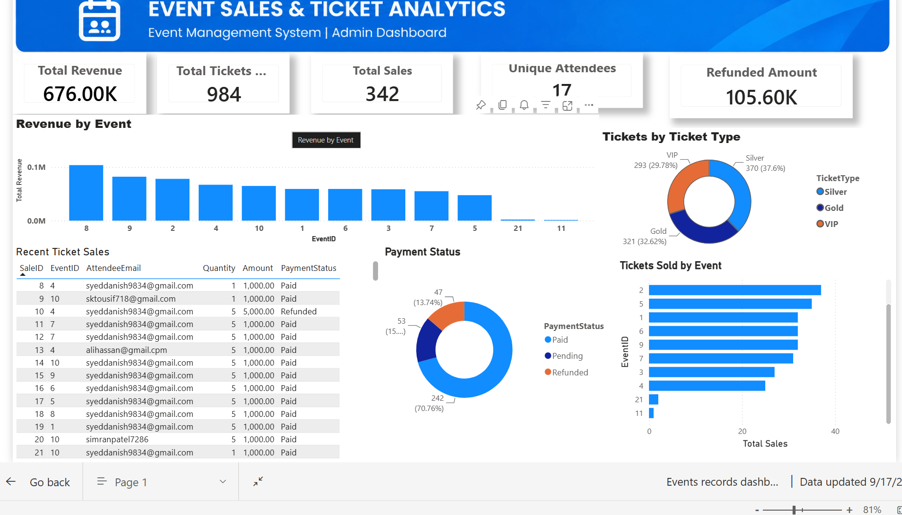

# Employee Analytics Dashboard – Power BI

An interactive Employee Analytics Dashboard developed using Microsoft Power BI to analyze employee information, salary, department, status, and joining trends.

## Dashboard Preview

---

## 🔗 Live Dashboard

👉 **[Click here to view the interactive Power BI Dashboard](https://app.powerbi.com/view?r=eyJrIjoiYjJlMWNhYmMtNzEzNC00NGUzLWI2M2EtMjQxYzFiOTk2N2ZkIiwidCI6IjNkNjFhOTViLTczMjktNDdhYi1iNGZiLTMwYWEwYWMwZGMzNSJ9)**

---

## Key KPIs

- Total Employees
- Total Salary
- Average Salary
- Active Employees

## Dashboard Features

- Employee count analysis
- Department-wise employee distribution
- Year-wise employee analysis
- Employee status analysis
- Salary analysis
- Interactive slicers for:
  - City
  - Department
  - Join Date
  - Status
- Detailed employee data table
- Interactive filtering and cross-filtering

## Tools & Technologies

- Microsoft Power BI
- Power Query
- DAX
- Excel
- Data Modeling

## Data Model

The dashboard uses an employee dataset containing information such as:

- Employee Name
- Department
- City
- Status
- Join Date
- Salary

## DAX Measures

Example measures used in the dashboard:

DAX
Total Employees = COUNTROWS(Employees)

Total Salary = SUM(Employees[Salary])

Average Salary = AVERAGE(Employees[Salary])

Active Employees =
CALCULATE(
    COUNTROWS(Employees),
    Employees[Status] = "Active"
)

## 👨‍💻 Author
**Syed Danish**  
Aspiring Data Analyst | Power BI | Python | SQL  

GitHub: https://github.com/Danish9834
---

If you found this project useful, feel free to ⭐ the repository.

